# Admin Guide

**For:** club committee members who run the website.
**Website:** https://umdsc-dance-class.umdancesportc.workers.dev/admin/login
**Use a laptop or PC.** All admin pages also work on a phone, but setting things up is easier on a big screen.

Admins can do everything class leads can do; see the **Class Lead Guide** for attendance and uploads. This guide covers setting up and managing the club's data.

---

## 1. Log in and find your way

Log in at **/admin/login** with your **username** and **password**, then tap **LOGIN**.

The left menu has **Calendar, Attendance, Media, Dancers**, and under **More**: **Dance Styles, Instructors, Roles & Permissions, Admin Accounts, System Settings, Events**.

The **EVENT:** picker at the top chooses which event (month) every page shows.

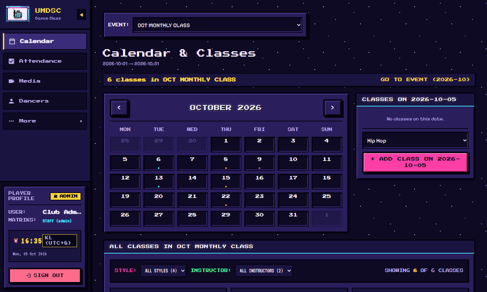

---

## 2. Events: one per monthly class, trial class or workshop

Each event has its **own Google Form** for registration. Dancers who fill in the form are imported automatically.

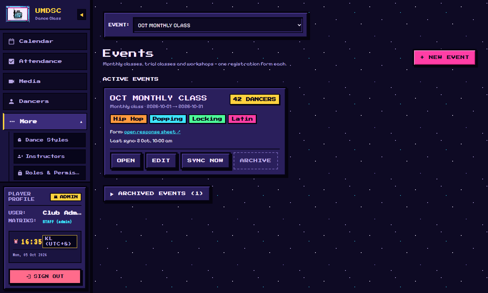

### Create a new event

**Before you start:**
- Create the event's **Google Form**, and link it to a **response sheet**.
- **Share the response sheet with `umdancesportc@gmail.com` as Editor.** The website refuses links it cannot edit.
- Make sure the form has a question where dancers choose their class(es).

Then click **Events › + NEW EVENT** and go through the 5 steps:

1. **FORM LINK:** paste the **Google Form response sheet link**, then choose the **Class choice** column, i.e. the form question where dancers pick their classes.
2. **DETAILS:** **Event name** (for example `NOV MONTHLY CLASS`), **Event type**, **Start day** and **End day**.
3. **STYLES:** tick the dance styles taught in this event. If some class answers in the form don't match a style, the wizard lists them under **CLASS ANSWERS THAT MATCH NO STYLE**. Fix them by adding an **alias** to the style (see section 3).
4. **SCHEDULE:** for each style, use **AUTO-FILL** (day, start time, end time, number of classes) to create all the classes at once, then adjust single dates if needed.
5. **REVIEW:** check everything, then create the event.

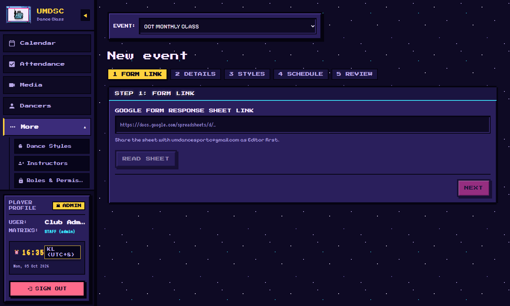

### Look after events

- **SYNC NOW:** imports new form registrations immediately. This also runs automatically.
- **EDIT:** change the details, styles or schedule.
- **ARCHIVE:** when a month is over, archive it. Archived events stop syncing and move under **ARCHIVED EVENTS**.

---

## 3. Dance styles

**More › Dance Styles.** Each style (Hip Hop, Popping, Locking, Latin…) has:

| Field | Meaning |
|---|---|
| **Style Name** | Shown everywhere |
| **Aliases (comma-separated)** | Other ways dancers write it in the form, for example `hiphop, hip-hop`. Used to match form answers to the style. |
| **Color Swatch** | The style's colour on calendars |
| **Default Day / Start Time / End Time / Default Instructor / Default Venue** | Used when creating classes |
| **Attendance Folder Link / Video Folder Link** | Optional Drive folders for this style |

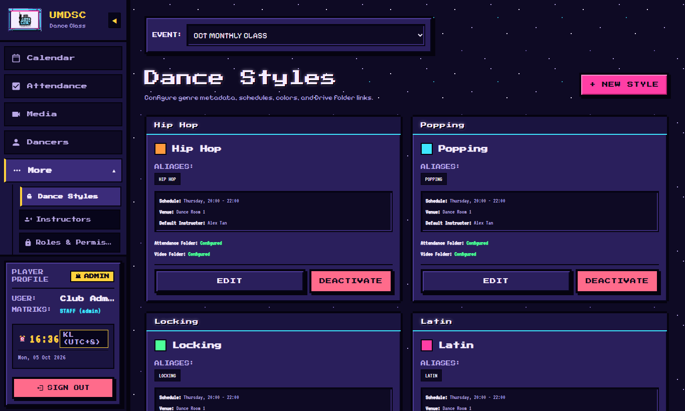
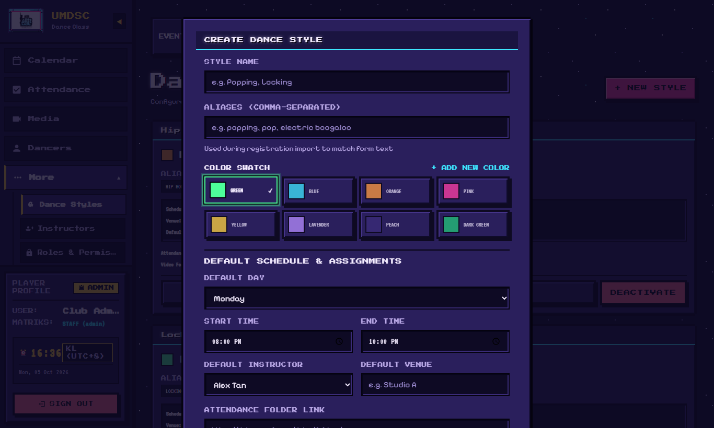

---

## 4. Instructors

**More › Instructors › + NEW INSTRUCTOR.** Enter **Full Name**, **Contact (Phone / WhatsApp)** and **Instructor Signature Color**. Add a photo with **+ UPLOAD PICTURE** (recommended size 1080 × 1350, portrait), or **+ LINK URL** for a photo already online. Several photos can be kept; the **ACTIVE** one is shown to dancers.

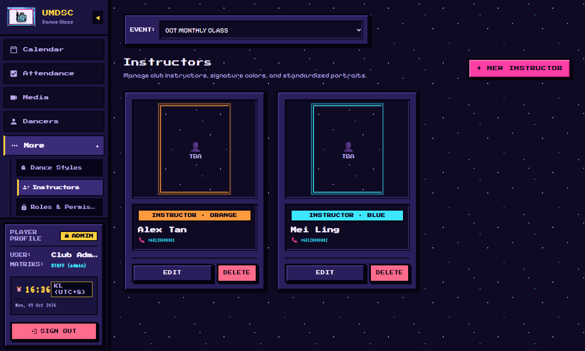
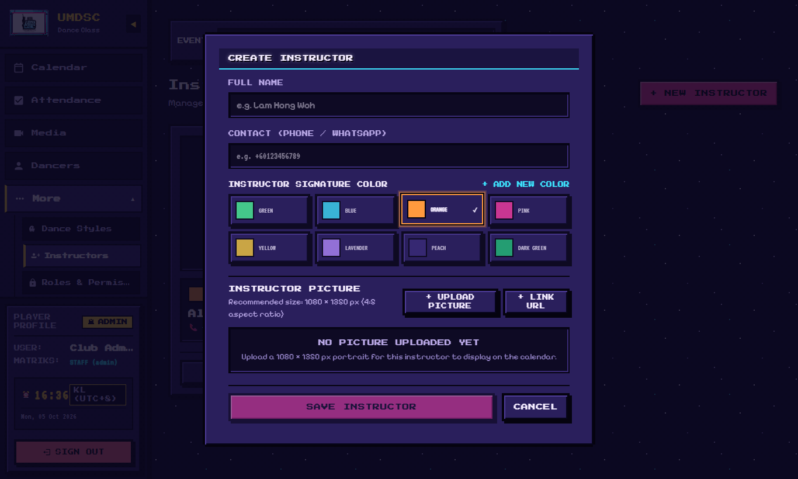

---

## 5. Classes (calendar)

**Calendar** shows all classes of the chosen event. Filter by **dance style** or **instructor**.
- Click a class to edit its **date**, **venue**, **instructor** (or a **replacement**), and a **note**. Its status can be set to **scheduled**, **replacement** or **cancelled**.
- Add an extra class by choosing the **event** and **style** for the new class.

---

## 6. Dancers

**Dancers** lists everyone registered for the chosen event: **matric number, full name, contact, email, gender**, and their classes. Use **Search name, matric, phone…** to find someone.

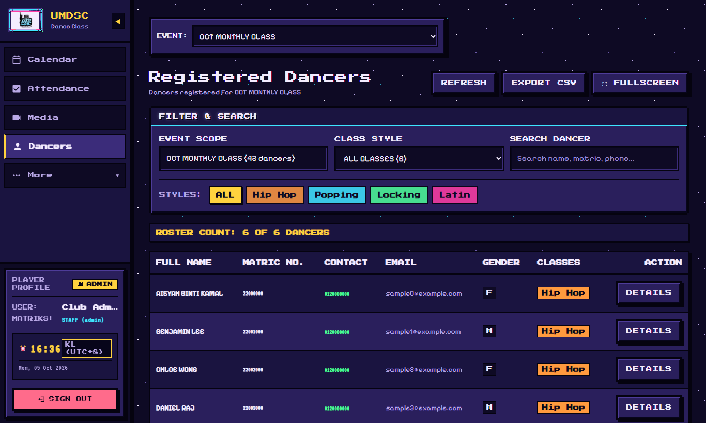

> Dancer details come from the Google Form. To fix a name, correct it in the **form response sheet**, then **SYNC NOW**.

---

## 7. Media: class lead video folders

**Media › CLASS LEAD VIDEO DRIVE FOLDERS.** Each dance style uploads its videos into its **class lead's own Google Drive folder**.

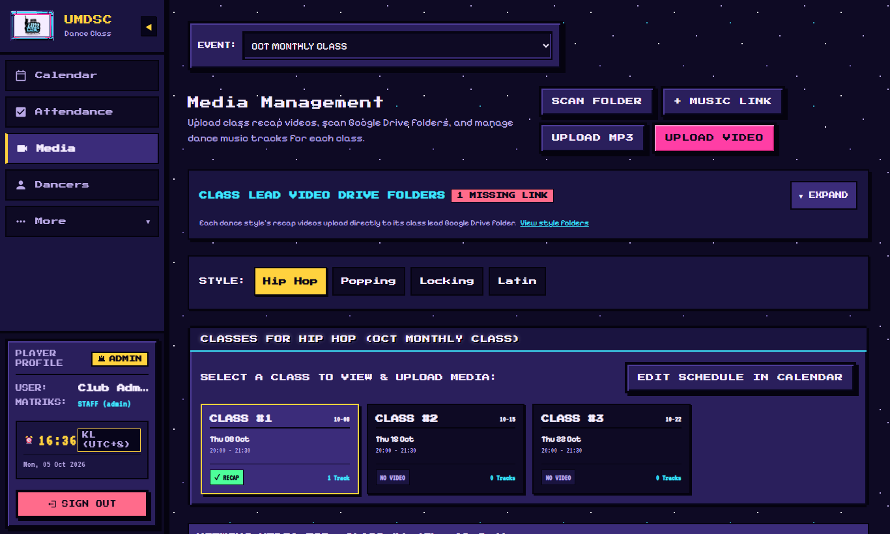

For each style:
- **+ INSERT LINK / CHANGE LINK:** paste the class lead's folder link. The folder must be **shared with `umdancesportc@gmail.com` as Editor**.
- **REMOVE LINK:** disconnect the folder. Uploads are blocked for that style until a new link is inserted. Videos already in Drive are not touched.
- **AUTHORIZE:** links the folder to a **Google account**. Uploads for that style then **must** use that account, and use its storage. Before tapping AUTHORIZE, use **SWITCH ACCOUNT** to choose the **class lead's** Gmail. The row then shows **Uploads as** *that Gmail*.

The same page is used for uploading videos and music; see the Class Lead Guide.

---

## 8. Roles & permissions

**More › Roles & Permissions.** A **role** is a set of permissions. Two are built in: **Admin** (everything) and **Dancer** (calendar, own attendance, videos, music).

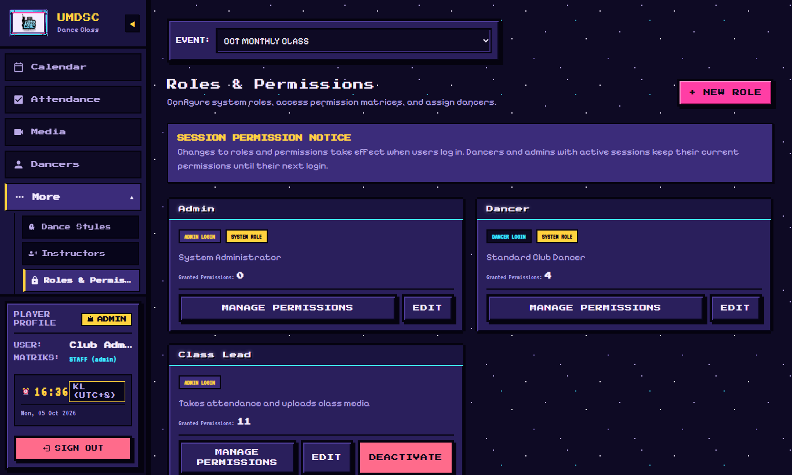

### The Class Lead role (create it once)

1. **+ NEW ROLE:** **Role Name** `Class Lead`, **Login Type `Admin`**, then **SAVE ROLE**.
   > It must be **Admin** login type. Dancer-type accounts cannot open the Attendance or Media pages.
2. **MANAGE PERMISSIONS** and tick:
   `calendar.view`, `attendance.view.all`, `attendance.edit`, `export.download`, `members.view`, `videos.view`, `videos.upload`, `videos.edit`, `music.view`, `music.edit`, `sections.edit`, and **`styles.edit`**. The last one lets class leads AUTHORIZE their own folder; it also lets them edit dance styles.
3. Click **SAVE PERMISSIONS**.

Never give `settings.edit`, `admins.manage` or `roles.manage` to class leads.

> When you change a role's permissions, everyone with that role is asked to log in again.

---

## 9. Admin accounts

**More › Admin Accounts › + NEW ADMIN.** Create an account for each admin and each class lead: **Username**, **Display Name**, **Initial Password**, **Assigned Role**. Send the username and password **privately**, for example in a direct message, never in a group.

- **Forgotten password:** **RESET PASSWORD** on their account, enter a **New Password**, then **UPDATE PASSWORD**.
- **Someone leaves:** **DEACTIVATE** their account.

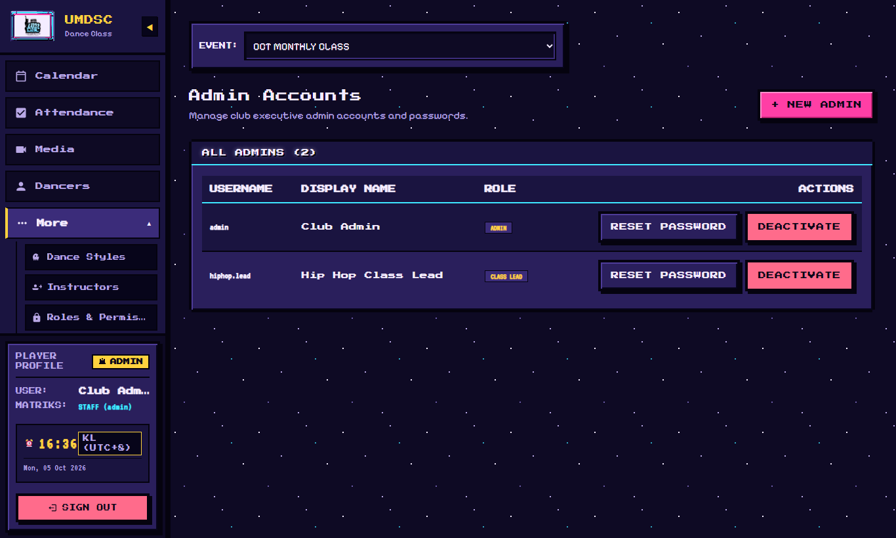
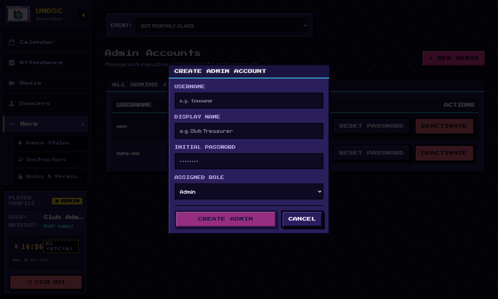

> The full step-by-step for a new class lead (account, Google sign-in list, folder) is in the **Admin Handover Guide**, section 4.

---

## 10. System settings

**More › System Settings.**

| Setting | Meaning |
|---|---|
| **Database Folder** | The Google Drive folder that holds the website's database (a Google Sheet). Do not delete it. |
| **Default Attendance Folder** | Where attendance sheets are created. Also shown on the **Attendance** page. |
| **Link Update History** | Who changed which folder link, and when. |
| **Data Retention (3 years)** | Old data is cleared after 3 years. |
| **Reset Test Data** | ⚠️ Only for before the real launch: it deletes test data. You must type a confirmation. |

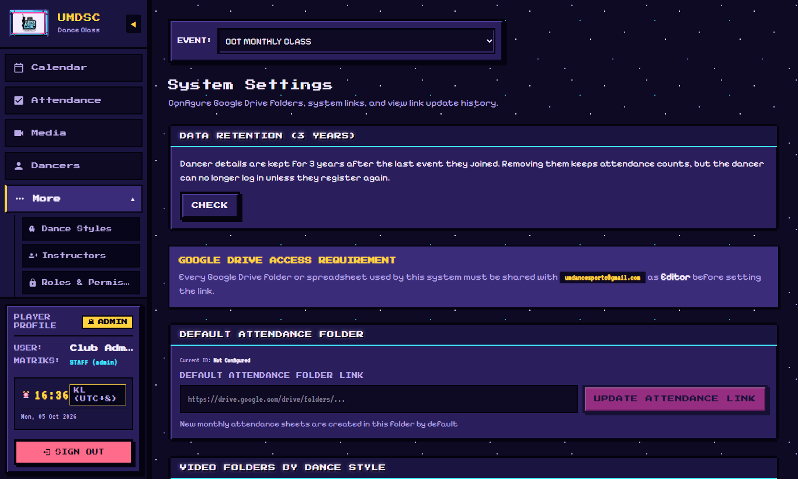
