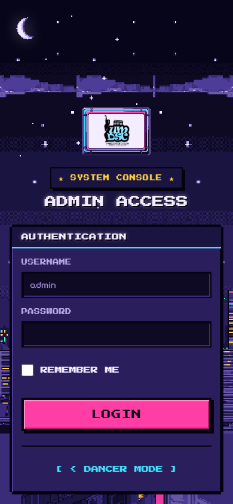
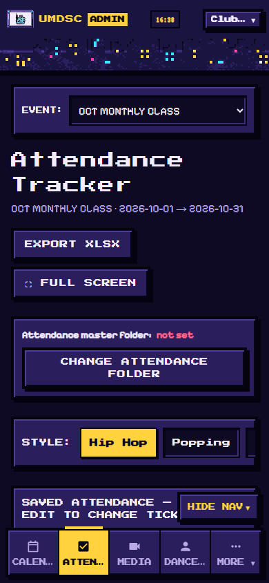
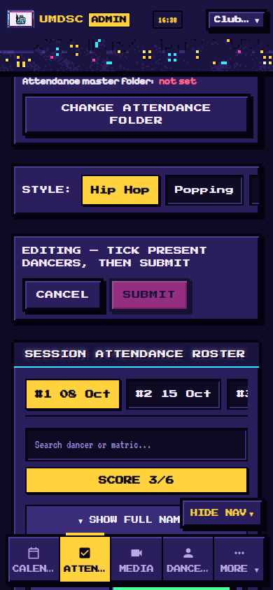
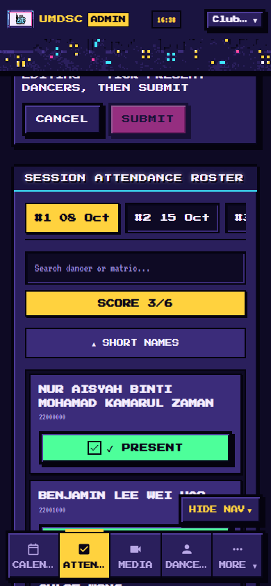
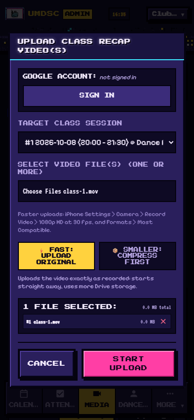

# 课程负责人（Class Lead）使用指南

**适用对象：**负责点名、上传课程视频和音乐的课程负责人。
**网站：**https://umdsc-dance-class.umdancesportc.workers.dev
**设备：**手机或电脑都可以。有两个步骤在电脑上更方便，已用 💻 标出。

> 网站界面是英文的，所以本指南中的**按钮名称保留英文**，方便你在网站上找到。

---

## 1. 第一堂课之前（向管理员索取）

你需要管理员给你准备四样东西：

1. **课程负责人账号：**网站的**用户名（username）**和**密码（password）**。
2. **把你的 Gmail 加入网站的 Google 登录名单。**否则上传时 Google 会拒绝你登录。
3. **一个存放你舞种视频的 Google Drive 文件夹。**在你自己的 Google Drive 新建文件夹（例如 “Locking Class Videos”），然后**以编辑者（Editor）身份共享给 `umdancesportc@gmail.com`**。
4. **在网站上填入文件夹链接。**把文件夹链接发给管理员，由管理员为你的舞种填入。

> 你的视频保存在**你自己的** Drive 文件夹里，占用的是**你的** Google 存储空间。

---

## 2. 登录

1. 打开网站，在网址后面加上 **`/admin/login`**：
   `https://umdsc-dance-class.umdancesportc.workers.dev/admin/login`
2. 输入**用户名**和**密码**，点 **LOGIN**。

**在手机上**，菜单在屏幕底部：**Calendar（日历）· Attendance（点名）· Media（媒体）· Dancers（舞者）· More（更多）**。如果菜单挡住了内容，点 **HIDE NAV** 隐藏；点 **SHOW NAV** 再显示。

> 有些菜单页面（例如 Settings 设置）只有管理员能用。打开时网站会显示错误，这是正常的。

---

## 3. 点名

1. 点 **Attendance**。
2. 确认顶部的 **EVENT（活动）**，例如 *OCT MONTHLY CLASS*（十月月度课程）。需要的话可以切换。
3. 点你的 **STYLE（舞种）**，例如 *Hip Hop*。
4. 点你要上的那一堂**课**，例如 **#3 22 Oct**。

5. 点 **EDIT**（编辑）。
6. 有来上课的舞者，点他名字旁的 **ABSENT**（缺席），会变成绿色的 **✓ PRESENT**（出席）。再点一次可以取消。
   - **SCORE** 显示目前出席人数。
   - 用 **Search dancer or matric…** 搜索框可以快速找人（姓名或学号）。
   - 手机上名字太长被截断？点 **▼ SHOW FULL NAMES** 显示完整姓名。网站会在你的手机上记住这个设置。
7. 点 **SUBMIT**（提交）保存。**没按 SUBMIT 之前，勾选不会被保存。**

**注意事项：**
- 如果还没按 SUBMIT 就想关闭页面，网站会提醒你。
- 保存时如果网络断了，网站会在后台自动重试。请保持页面打开，直到完成。
- 其他课程负责人可以同时点名，他们的勾选大约 20 秒内会出现在你的屏幕上。
- **EXPORT XLSX** 可以把点名记录下载成 Excel 文件；**sheet 链接**会在 Google Sheets 中打开点名表。

---

## 4. 只需做一次：授权你的视频文件夹 💻

在第一次上传之前做**一次**，建议用电脑。

1. 登录后打开 **Media**。
2. 找到 **CLASS LEAD VIDEO DRIVE FOLDERS**（课程负责人视频文件夹），点 **▼ EXPAND** 展开。
3. 看 **Google account:**（Google 账号）一栏：
   - 显示的是**你的** Gmail？很好。
   - 显示别的账号，或 *not signed in*（未登录）？点 **SWITCH ACCOUNT**（切换账号）或 **SIGN IN**（登录），选择**你的** Gmail。
4. 在**你舞种的那一行**，点 **AUTHORIZE**（授权）。
5. Google 会弹出一个只显示**一个文件夹**的窗口，那就是你的文件夹。点选它，再点 **Select**。
6. 这一行会显示 **✓ AUTHORIZED**（已授权），以及 **Uploads as** *你的 Gmail*（以你的账号上传）。

> **看不到 AUTHORIZE 按钮？**你的账号可能没有编辑舞种的权限。请管理员和你一起，用你的 Gmail 登录后完成这一步。

---

## 5. 上传课程视频

1. 打开 **Media**。
2. 在顶部选择 **EVENT（活动）**和你的 **STYLE（舞种）**。
3. 点那堂课的**课程卡片**（例如 **CLASS #3**），再点 **+ ADD RECAP FOR CLASS #3**；或直接点 **UPLOAD VIDEO**。
4. 确认 **Google account:** 显示的是**你的** Gmail；不是的话点 **SWITCH ACCOUNT**。
5. 确认 **TARGET CLASS SESSION**（目标课程）是正确的那一堂课。
6. 点 **Choose Files** 选择视频，可以一次选多个。
7. 选择上传方式：
   - **⚡ FAST: UPLOAD ORIGINAL**（快速：上传原片）：马上开始上传，保持原画质，但占用较多存储空间。150 MB 以下的视频，网站会默认选这个。
   - **📦 SMALLER: COMPRESS FIRST**（更小：先压缩）：手机先把视频压缩成 720p，开始得比较慢，但节省存储空间和流量。超过 150 MB 的视频，网站会默认选这个。
8. 点 **START UPLOAD**（开始上传）。
9. **保持屏幕亮着、页面开着**，直到上传完成。手机锁屏会暂停上传。

**加快上传的小技巧（iPhone）：**设置 › 相机 › 录制视频 › **1080p HD，30 fps**；以及设置 › 相机 › 格式 › **兼容性最佳**。

**如果上传被阻止，**网站的提示会告诉你原因：

| 提示信息 | 怎么做 |
|---|---|
| *Class lead video folder link not inserted*（未填入文件夹链接） | 请管理员填入你的文件夹链接。 |
| *…has no upload account yet*（尚未设置上传账号） | 完成第 4 节（授权）。 |
| *…uploads with X, but you're signed in as Y*（应使用 X，但你登录的是 Y） | 点 **SWITCH ACCOUNT**，选择 X。 |
| *This class lead folder isn't authorized yet*（文件夹尚未授权） | 用电脑完成第 4 节。 |

### 删除视频

在视频上点 **DELETE**（或 **DEL**），然后确认。视频会从网站上移除，文件会移到 **Google Drive 回收站**，30 天内可以恢复。

---

## 6. 添加课程音乐

在 **Media** 页面选好课程后：

- **+ MUSIC LINK**（音乐链接）：粘贴 **YouTube、Spotify、SoundCloud 或 Google Drive MP3** 链接，填写 **Track Title**（歌名），在 **Link to Session** 选择对应的课，然后保存。
- **UPLOAD MP3**：从你的设备上传 MP3 文件。

### 练习段落

在音乐下方点 **MANAGE SECTIONS**（管理段落），可以添加有名字的段落，例如 **Chorus part A**（副歌 A 段），从 0:15 到 0:45。舞者在 **Studio**（练习室）里能看到这些段落，并可以循环播放来练习。

---

## 7. 每堂课的快速清单

- [ ] 点名：**EDIT** → 勾选 → **SUBMIT**
- [ ] 视频：**Media** → 选课 → 上传（屏幕保持亮着）
- [ ] 音乐和段落（如有新的）

有问题请联系社团管理员。
