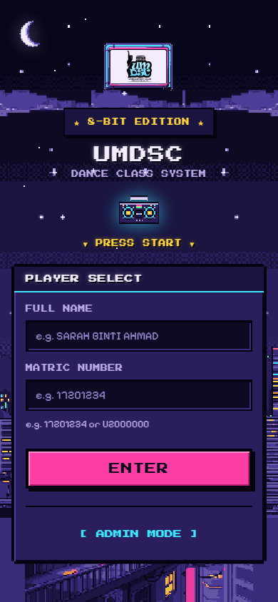
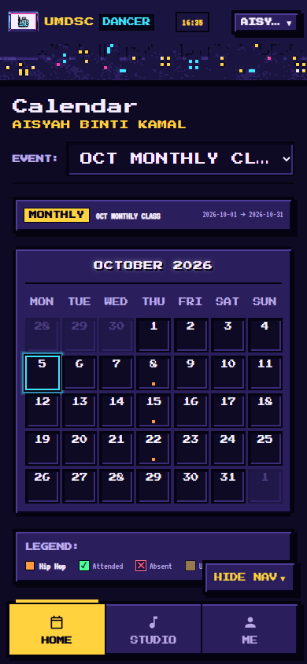
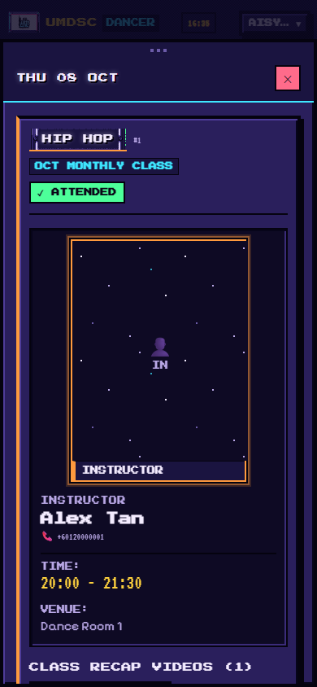
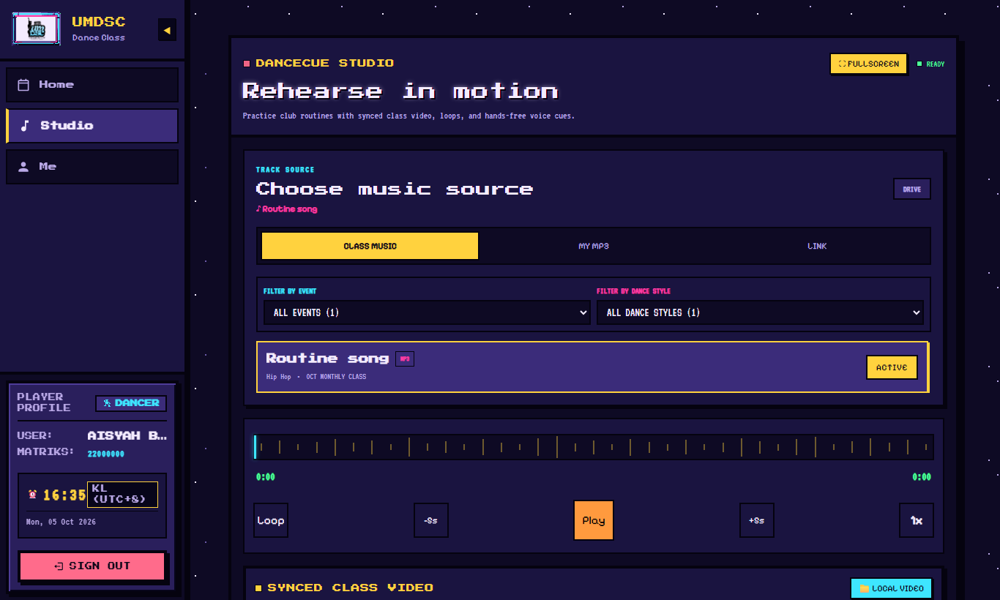
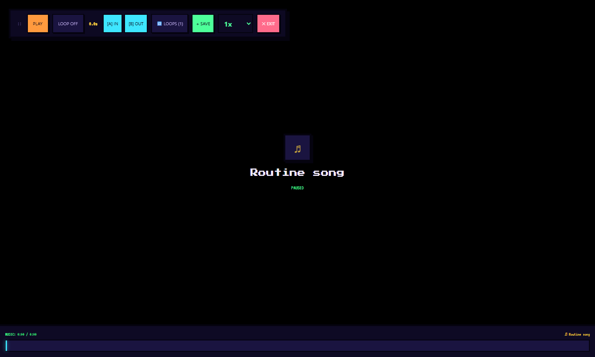
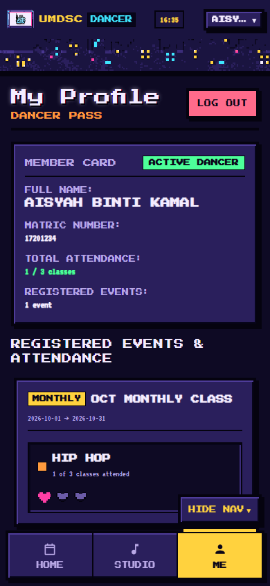

# 舞者使用指南

**适用对象：**UM Dancesport Club（UMDSC）的舞者。
**网站：**https://umdsc-dance-class.umdancesportc.workers.dev

用它查看你的课程表、观看课程回顾视频、跟着课程音乐练习，以及查看你的出席记录。

> 💻 **建议：**日历用手机看就很方便。但 **Studio（练习室）**（配合音乐和视频练习）用**笔记本电脑或台式电脑**会方便很多：屏幕更大、有键盘，语音指令在 Chrome 浏览器中效果最好。

> 网站界面是英文的，本指南中的**按钮名称保留英文**。

---

## 1. 登录

1. 打开网站。
2. 输入你的 **Matric Number**（学号），例如 `22001234`。
3. 输入你的 **Full Name**（全名），要和你在**报名表**上填写的一样。名字的每个部分都要写，但大小写和顺序不影响。
4. 点 **ENTER**。

**登录不了？**你会看到 *"Matric number and name don't match a registered dancer."*（学号和姓名与已报名的舞者不符）。请确认：
- 你已经通过社团的 Google 表格报名了本月的课程；
- 你填写的名字和报名表一致，每个部分都要有（*binti*/*bin* 可以省略，其他部分不行）。

还是不行？请联系你的课程负责人或社团管理员。

**把网站变成 App：**Safari 点 **分享 › 添加到主屏幕**；Chrome 点 **⋮ › 添加到主屏幕**。

---

## 2. 你的日历

**Home**（首页）显示你的课程日历，每个彩色标记代表你的一个舞种。

点**有课的日期**，可以看到详情：时间、地点、老师，以及那堂课的**回顾视频**和**音乐**。

如果你参加了不止一个活动（例如月度课程和工作坊），可以在顶部的 **EVENT:** 选择。

---

## 3. Studio 练习室：配合音乐和视频练习 💻

从菜单打开 **Studio**。

1. 在 **Choose music source**（选择音乐来源）**选音乐**：
   - **CLASS MUSIC**：课程负责人添加的歌曲，可以按活动和舞种筛选。
   - **MY MP3**：播放你自己设备上的音乐文件。
   - **LINK**：粘贴 YouTube 或 SoundCloud 链接。
2. **播放控制：Play**（播放）、**-5s / +5s**（后退/前进 5 秒）、**Loop**（循环），以及速度 **1x**（可以调慢来学动作）。
3. **循环段落：**课程负责人设定的 **Class Sections**（课程段落，例如 *Chorus part A*）会出现在 **Markers** 里，点一下就能循环播放。点 **Add Loop** 可以添加你自己的循环段落。
4. **SYNCED CLASS VIDEO**（同步课程视频）：选择课程回顾视频，让它跟音乐同步播放；或点 **LOCAL VIDEO** 使用你设备上的视频。**SET START HERE** 用来对齐视频和音乐。
5. **FULLSCREEN**（全屏）：大画面视频，控制按钮在上方。点 **EXIT** 退出。

### Voice Cue 语音指令（不用动手）

在 **Voice Cue** 下按麦克风，说出指令，例如 **"Play"**（播放）、**"Pause"**（暂停）、**"Loop chorus"**（循环副歌）、**"Back 5 seconds"**（后退 5 秒）或 **"Restart"**（重新开始）。语音控制在**笔记本/台式电脑的 Chrome** 上效果最好。如果你的浏览器不支持，请改用页面上显示的按钮。

---

## 4. Me（我的）：你的出席记录

打开 **Me**，可以看到你的**学号**、**已报名的活动**和**总出席次数**。

在公用电脑上使用后，请点 **LOG OUT**（登出）。

---

## 常见问题

| 问题 | 怎么做 |
|---|---|
| 视频播放不了 | 用 Wi-Fi 再试一次。有些 iPhone 拍的视频会改用 Google Drive 播放器打开。 |
| 我的出席记录不对 | 告诉你的课程负责人，他们可以更正。 |
| 网站更新后看起来还是旧的 | 关闭网页标签，再重新打开。 |
